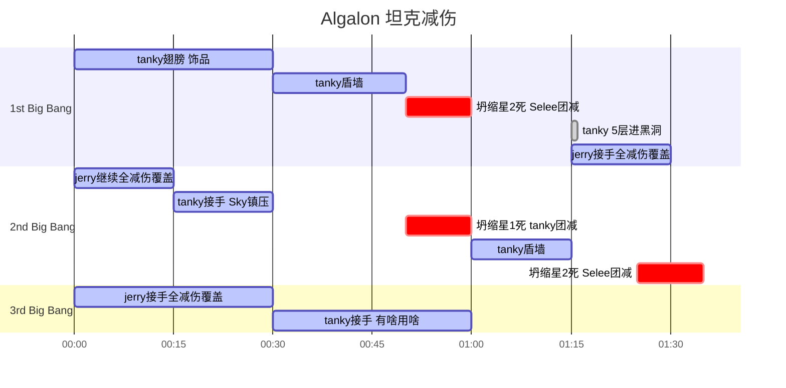

## FL

| 区域或标记      | 任务分配 | 演员 |
| ----------- | ----------- | ----------- |
| 打手区      | 疯狂输出 全村希望 不发射      | 主:Selee 副:Lei |
| 炮手区   | 副驾轮流发射 尽量输出       | 主:蘑菇 副:Sky+Handy       |
| 坦克A   | 下半场打断 副:小花破冰打蓝铁  | 主:Lsp 副:Otanky        |
| 坦克B   | 下半场打断 副:小花破冰打蓝铁  | 主:Jerry 副:Stitch        |
| 划水摩托   | 小花boss浦油 接人       | Demonfufu        |

#### 本周改进

- 坦克：清理场面小花 > 打蓝铁 注意破冰
- 炮手区投石车：提高DoT层数和Uptime
- 摩托：开心划水

## XT

#### 本周改进

- **起手偷药 开1分钟cd 跳过第一个发脾气 比如蘑菇开一个爆发**
- 注意嫁祸误导life spark 快速cleave掉 如：给DoT 瞬发伤害技能

## Iron Council

#### 本周改进

- 注意起手打断（最好沉默）矮子 嫁祸误导tanky tanky起手翅膀接怪
- P1 overload不跑 **Sky**注意全团套盾 **Selee**团减
- P1 tanky拉远点 boss不能踩圈
- P2 可偷力量符文 但死亡符文必须分开 死人惩罚
- P2 & P3 dps全部boss脚下集中 **治疗永远最远点 治疗永远最远点 治疗永远最远点**
- 必须打入3分钟

## Algalon

#### 本周改进

- 所有人
    - **不要黑洞一日游 不要黑洞一日游 不要黑洞一日游**
    - 红色流星伤害不准超过3k **多走几步 多走几步 多走几步**
- 坍缩星
    - **不要碰 不要碰 不要碰**
    - Leilei奥法
- 活体星座
    - jerry看情况消除 防止误入黑洞
- 黑洞
    - 黑圈并非传送触发hitbox 而是紫色的点 注意位置
- P2
    - 10%开大军
    - selee保护sky
    - tanky保护蘑菇
    - selee自己无敌
- 求稳走三奶
    - 战术特点：几乎无容错
    - Handy不能死

## Kologarn

#### 本周改进

- 起手英勇 全力本体 可cleave左手（屏幕右边的手）**完全不主动碰右手**
- 有人被抓 Jerry/Stitch/Lsp转火右手 人救出来后 立刻停手 继续boss
- 本体35% Jerry/Stitch/Lsp转火右手 蘑菇/Handy/Lei转火左手 尽量双手一起死
- **不打小怪 不打小怪 不打小怪**

## Cat Lady

#### 本周改进

- 单奶 单坦
- 嫁祸误导 开翅膀 (需要减伤开团减 牺牲之手)
- 起手Selee => Demonfufu保护
- 只打boss
- 防恐结界坦克tanky
- 注意人类自利 驱散唯一一轮恐惧
- 豹群aoe掉 单体小怪不问
- **要求：50s结束战斗**

## Hodir

#### 本周改进

- Tanky起手翅膀 嫁祸误导打满
- 三大主力 Handy/Sky/Lei **集中集中集中** 传好雷云
- **本周小目标：1：30结束战斗**
- **注意仇恨 注意仇恨 注意仇恨**

## Thorim

| 标记      | 演员 |
| ----------- | ----------- |
| 近战1      | Jerry       |
| 近战2   |         |
| 近战3   | Stitch        |
| 奶骑奶德   | Selee        |
| 奶骑戒律   | Sky        |
| 远程4   | 蘑菇        |
| 远程5   | Lsp        |
| 远程6   | Lei        |
| 远程7   | Handy        |
| 远程8   | Demonfufu        |

#### 本周改进

- 毒奶君：你的锤子呐 :hammer::hammer::hammer:
- Sky没事打打惩击 

## Freya

#### 本周改进

- Snaplasher快死时候 tanky注意减伤 或者风筝走
- Lei龙溪等我喊 龙溪之后立刻开跑
- **别死人 别死人 别死人**

## Mimiron

#### 本周改进

- P1
    - Lsp最外圈引火
    - 起手翅膀 嫁祸误导满 减伤顺序:镇压 => 盾墙
    - 注意等一灭火 然后击杀boss
- P2
    - P1转P2 外圈引火
    - 分散死里打
- P3
    - P2转P3 中心引火
    - 标记2灭火不杀 误导+灌注Demonfufu
    - Tanky控制小怪 撞炸弹
    - Lsp风筝坦克大机器人 Jerry负责减速
    - 全力击杀大机器人1号 然后全力击杀boss
    - boss死后清场
- P4
    - Tanky嘲讽头部 拿走仇恨
    - 中圈坦克
    - 出水球或者火太多 大团移动1/3扇区

## Vezax

#### 本周改进

- P1:采用远程全分散站位 5远程一人一坑 吸血Mark不移动 Shadow点名谁谁移动
- P2:恢复两堆儿 
- Tanky起手翅膀 P2起手翅膀接怪 减伤:镇压=>盾墙=>团减牺牲=>镇压 收工
- P2起手 远程DPS等8w仇恨

## Yogg

| Portal      | 演员 | 进门后任务
| ----------- | ----------- | ----------- |
| 远端左      | Lsp       | 击杀远点 |
| 远端右   | Stitch        | 击杀远点 |
| 近端左      | Demonfufu       | 击杀近点 |
| 近端右   | Jerry        | 击杀近点 |

#### 本周改进

- P1
    - 近战注意规避 注意打断（法师萨满注意帮忙补）
- P2
    - 优先级：救人 > 远程大触手 = 近战小触手
    - Portal提前7-8s落位置
    - 统一火箭鞋进大脑房间 然后英勇
    - **目标一轮P3**
- P3
    - 无脑灌注Handy 全力抽
    - **继续压缩击杀时间 下周0灯**

## Razor

#### 本周改进

- 看时间做成就
    - 双坦双奶
    - 不允许放不可控aoe，如疾病 陷阱 种子 活体炸弹
    - 允许aoe，如 火雨 暴风雪 奥爆

## Ignis

#### 本周改进

- 毒奶君：你的锤子呐 :hammer::hammer::hammer:
